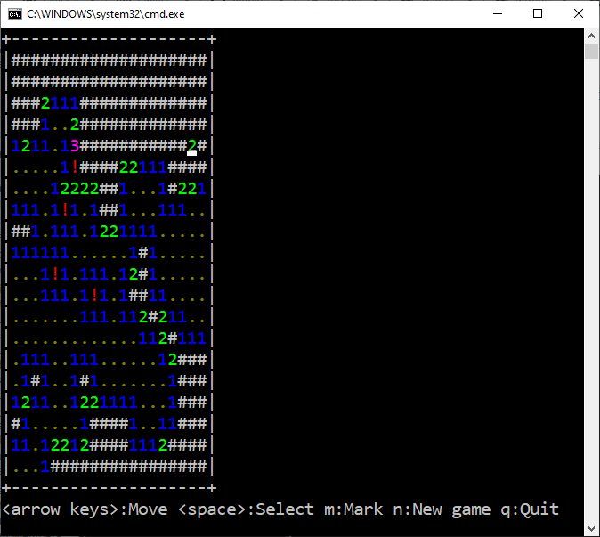
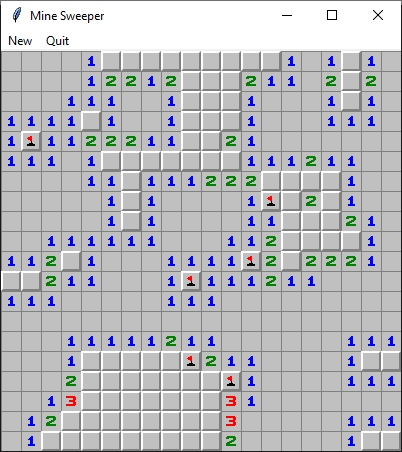

# MineSweeper
This is a multi-platform (Windows/Linux) implementation of MineSweeper Game.

It can be run in two modes:
* Console Mode: 

Run the script "con_mines.py"

* Graphics Mode:

Run the script "tk_mines.py"

The repository contains two utility modules:
* Common Game Logic: "mines.py"
* Common Console I/O Logic (for both Linux and Windows): "conio.py"
